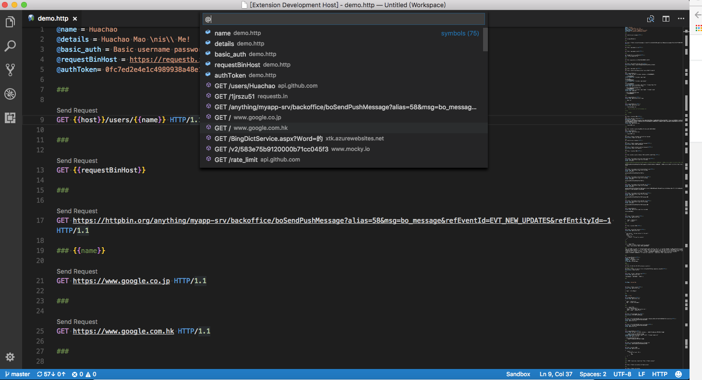

# REST Client

[](https://gitter.im/Huachao/vscode-restclient?utm_source=badge&utm_medium=badge&utm_campaign=pr-badge&utm_content=badge) [](https://marketplace.visualstudio.com/items?itemName=humao.rest-client) [](https://marketplace.visualstudio.com/items?itemName=humao.rest-client) [](https://marketplace.visualstudio.com/items?itemName=humao.rest-client) [](https://david-dm.org/Huachao/vscode-restclient)

REST Client allows you to send HTTP request and view the response in Visual Studio Code directly.

## Main Features
* Send/Cancel/Rerun __HTTP request__ in editor and view response in a separate pane with syntax highlight
* Send __CURL command__ in editor and copy HTTP request as `CURL command`
* Auto save and view/clear request history
* Support _MULTIPLE_ requests in the same file (separated by `###` delimiter)
* View image response directly in pane
* Save raw response and response body only to local disk
* Customize font(size/family/weight) in response preview
* Preview response with expected parts(_headers only_, _body only_, _full response_ and _both request and response_)
* Authentication support for:
    - Basic Auth
    - Digest Auth
    - SSL Client Certificates
* Environments and custom/global system variables support
    - Use custom/global variables in any place of request(_URL_, _Headers_, _Body_)
    - Support both __environment__ and __file__ custom variables
    - Auto completion and hover support for both environment and file custom variables
    - Go to definition and find all references support _ONLY_ for file custom variables
    - Provide system dynamic variables `{{$guid}}`, `{{$randomInt min max}}`, `{{$timestamp}}`, and `{{$aadToken [new] [public|cn|de|us|ppe] [<domain|tenantId>]}}`
    - Easily create/update/delete environments and custom variables in setting file
    - Support environment switch
    - Support shared environment to provide variables that available in all environments
* Generate code snippets for __HTTP request__ in languages like `Python`, `Javascript` and more!
* Remember Cookies for subsequent requests
* Proxy support
* Send SOAP requests, as well as snippet support to build SOAP envelope easily
* `HTTP` language support
    - `.http` and `.rest` file extensions support
    - Syntax highlight (Request and Response)
    - Auto completion for method, url, header, custom/global variables, mime types and so on
    - Comments (line starts with `#` or `//`) support
    - Support `json` and `xml` body indentation, comment shortcut and auto closing brackets
    - Code snippets for operations like `GET` and `POST`
    - Support navigate to symbol definitions(request and file level custom variable) in open `http` file
    - CodeLens support to add an actionable link to send request
    - Fold/Unfold for request block

## Usage
In editor, type a HTTP request as simple as below:
```http
https://example.com/comments/1
```
Or, you can follow the standard [RFC 2616](http://www.w3.org/Protocols/rfc2616/rfc2616-sec5.html) that including request method, headers and body.
```http
POST https://example.com/comments HTTP/1.1
content-type: application/json

{
    "name": "sample",
    "time": "Wed, 21 Oct 2015 18:27:50 GMT"
}
```
Once you prepared a request, click the `Send Request` link above the request, or use shortcut `Ctrl+Alt+R`(`Cmd+Alt+R` for macOS), or right click in the editor and then select `Send Request` in the menu, or press `F1` and then select/type `Rest Client: Send Request`, the response will be previewed in a separate __webview__ panel of Visual Studio Code. If you'd like to use the full power of searching, selecting or manipulating in Visual Studio Code, you can also preview response in __an untitled document__ by setting `rest-client.previewResponseInUntitledDocument` to `true`, by default the value is `false`. When a request is issued,  will be displayed in the status bar, after receiving the response, the icon will be changed to the duration and response size.

You can view the breakdown of the response time when hovering over the duration status bar, you could view the duration details of _Socket_, _DNS_, _TCP_, _First Byte_ and _Download_.

When hovering over the response size status bar, you could view the breakdown response size details of _headers_ and _body_.

> All the shortcuts in REST Client Extension are __ONLY__ available for file language mode `http` and `plaintext`.

> __Send Request__ link above each request will only be visible when the request file is in `http` mode, more details can be found in [http language section](#http-language).

### Select Request Text
You may even want to save numerous requests in the same file and execute any of them as you wish easily. REST Client extension could recognize any line begins with three or more consecutive `#` as a delimiter between requests. Place the cursor anywhere between the delimiters, issuing the request as above, and it will first parse the text between the delimiters as request and then send it out.
```http
GET https://example.com/comments/1 HTTP/1.1

###

GET https://example.com/topics/1 HTTP/1.1

###

POST https://example.com/comments HTTP/1.1
content-type: application/json

{
    "name": "sample",
    "time": "Wed, 21 Oct 2015 18:27:50 GMT"
}
```
`REST Client Extension` also provides another flexibility that you can use mouse to highlight the text in file as request text.

## Install
Press `F1`, type `ext install` then search for `rest-client`.

## Making Request

### Request Line
The first non-empty line of the selection (or document if nothing is selected) is the _Request Line_.
Below are some examples of _Request Line_:
```http
GET https://example.com/comments/1 HTTP/1.1
```
```http
GET https://example.com/comments/1
```
```http
https://example.com/comments/1
```
If request method is omitted, request will be treated as __GET__, so above requests are the same after parsing.

#### Query Strings
You can always write query strings in the request line, like:
```http
GET https://example.com/comments?page=2&pageSize=10
```
Sometimes there may be several query parameters in a single request, putting all the query parameters in _Request Line_ is difficult to read and modify. So we allow you to spread query parameters into multiple lines(one line one query parameter), we will parse the lines in immediately after the _Request Line_ which starts with `?` and `&`, like
```http
GET https://example.com/comments
    ?page=2
    &pageSize=10
```

### Request Headers
The lines immediately after the _request line_ to first empty line are parsed as _Request Headers_. Please provide headers with the standard `field-name: field-value` format, each line represents one header. By default `REST Client Extension` will add a `User-Agent` header with value `vscode-restclient` in your request if you don't explicitly specify. You can also change the default value in setting `rest-client.defaultuseragent`.
Below are examples of _Request Headers_:
```http
User-Agent: rest-client
Accept-Language: en-GB,en-US;q=0.8,en;q=0.6,zh-CN;q=0.4
Content-Type: application/json
```

### Request Body
If you want to provide the request body, please add a blank line after the request headers like the POST example in usage, and all content after it will be treated as _Request Body_.
Below are examples of _Request Body_:

```http
POST https://example.com/comments HTTP/1.1
Content-Type: application/xml
Authorization: token xxx

<request>
    <name>sample</name>
    <time>Wed, 21 Oct 2015 18:27:50 GMT</time>
</request>
```

You can also specify file path to use as a body, which starts with `< `, the file path can be either in absolute or relative(relative to workspace root or current http file) formats:
```http
POST https://example.com/comments HTTP/1.1
Content-Type: application/xml
Authorization: token xxx

< C:\Users\Default\Desktop\demo.xml
```
```http
POST https://example.com/comments HTTP/1.1
Content-Type: application/xml
Authorization: token xxx

< ./demo.xml
```

When content type of request body is `multipart/form-data`, you may have the mixed format of the request body like following:
```http
POST https://api.example.com/user/upload
Content-Type: multipart/form-data; boundary=----WebKitFormBoundary7MA4YWxkTrZu0gW

------WebKitFormBoundary7MA4YWxkTrZu0gW
Content-Disposition: form-data; name="text"

title
------WebKitFormBoundary7MA4YWxkTrZu0gW
Content-Disposition: form-data; name="image"; filename="1.png"
Content-Type: image/png

< ./1.png
------WebKitFormBoundary7MA4YWxkTrZu0gW--
```

> When your mouse is over the document link, you can `Ctrl+Click`(`Cmd+Click` for macOS) to open the file in a new tab.

## Making CURL Request

We add the capability to directly run [curl request](https://curl.haxx.se/) in REST Client extension. The issuing request command is the same as raw HTTP one. REST Client will automatically parse the request with specified parser.

`REST Client` doesn't fully support all the options of `cURL`, since underneath we use `request` library to send request which doesn't accept all the `cURL` options. Supported options are listed below:
* -X, --request
* -L, --location, --url
* -H, --header(no _@_ support)
* -I, --head
* -b, --cookie(no cookie jar file support)
* -u, --user(Basic auth support only)
* -d, --data, --data-ascii,--data-binary

## Copy Request As cURL
Sometimes you may want to get the curl format of a http request quickly and save it to clipboard, just pressing `F1` and then selecting/typing `Rest Client: Copy Request As cURL` or simply right click in the editor, and select `Copy Request As cURL`.

## Cancel Request
Once you want to cancel a processing request, use shortcut `Ctrl+Alt+K`(`Cmd+Alt+K` for macOS), or press `F1` and then select/type `Rest Client: Cancel Request`.

## Rerun Last Request
Sometimes you may want to refresh the API response, now you could do it simply using shortcut `Ctrl+Alt+L`(`Cmd+Alt+L` for macOS), or press `F1` and then select/type `Rest Client: Rerun Last Request` to rerun last request.

## Request History

Each time we sent a http request, the request details(method, url, headers and body) would be persisted into file. By using shortcut `Ctrl+Alt+H`(`Cmd+Alt+H` for macOS), or press `F1` and then select/type `Rest Client: Request History`, you can view the last __50__ request items(method, url and request time) in the time reversing order, you can select any request you wish to trigger again. After specified request history item is selected, the request details would be displayed in a temp file, you can view the request details or follow previous step to trigger the request again.

You can also clear request history by pressing `F1` and then selecting/typing `Rest Client: Clear Request History`.

## Save Full Response

In the upper right corner of the response preview tab, we add a new icon to save the latest response to local file system. After you click the `Save Full Response` icon, it will prompt the window with the saved response file path. You can click the `Open` button to open the saved response file in current workspace, or click `Copy Path` to copy the saved response path to clipboard.

## Save Response Body
Another icon in the upper right corner of the response preview tab is the `Save Response Body` button, it will only save the response body __ONLY__ to local file system. The extension of saved file is set according to the response `MIME` type, like if the `Content-Type` value in response header is `application/json`, the saved file will have extension `.json`. You can also overwrite the `MIME` type and extension mapping according to your requirement with the `rest-client.mimeAndFileExtensionMapping` setting.
```json
"rest-client.mimeAndFileExtensionMapping": {
    "application/atom+xml": "xml"
}
```

## Authentication
We have supported some most common authentication schemes like _Basic Auth_, _Digest Auth_ and _SSL Client Certificates_.

See Global Variables for information about built-in support for Azure Active Directory.

### Basic Auth
HTTP Basic Auth is a widely used protocol for simple username/password authentication. We support __two__ formats of Authorization header to use Basic Auth.
1. Add the value of Authorization header in the base64 encoding of `username:password`.
2. Add the value of Authorization header in the raw value of `username` and `password`, which is separated by space.

The corresponding examples are as following:
```http
GET https://httpbin.org//basic-auth/user/passwd HTTP/1.1
Authorization: Basic dXNlcjpwYXNzd2Q=
```
and
```http
GET https://httpbin.org//basic-auth/user/passwd HTTP/1.1
Authorization: Basic user passwd
```

### Digest Auth
HTTP Digest Auth is also a username/password authentication protocol that aims to be slightly safer than Basic Auth. The format of Authorization header for Digest Auth is similar to Basic Auth. You just need to set the scheme to `Digest`, as well as the raw user name and password.
```http
GET https://httpbin.org/digest-auth/auth/user/passwd
Authorization: Digest user passwd
```

### SSL Client Certificates
We support `PFX`, `PKCS12`, and `PEM` certificates. Before using your certificates, you need to set the certificates paths(absolute/relative to workspace/relative to current http file) in the setting file for expected host name(port is optional). For each host, you can specify the key `cert`, `key`, `pfx` and `passphrase`.
- `cert`: Path of public x509 certificate
- `key`: Path of private key
- `pfx`: Path of PKCS #12 or PFX certificate
- `passphrase`: Optional passphrase for the certificate if required
You can add following piece of code in your setting file if your certificate is in `PEM` format:
```json
"rest-client.certificates": {
    "localhost:8081": {
        "cert": "/Users/demo/Certificates/client.crt",
        "key": "/Users/demo/Keys/client.key"
    },
    "example.com": {
        "cert": "/Users/demo/Certificates/client.crt",
        "key": "/Users/demo/Keys/client.key"
    }
}
```
Or if you have certificate in `PFX` or `PKCS12` format, setting code can be like this:
```json
"rest-client.certificates": {
    "localhost:8081": {
        "pfx": "/Users/demo/Certificates/clientcert.p12",
        "passphrase": "123456"
    }
}
```

## Generate Code Snippet

Once you’ve finalized your request in REST Client extension, you might want to make the same request from your own source code. We allow you to generate snippets of code in various languages and libraries that will help you achieve this. Once you prepared a request as previously, use shortcut `Ctrl+Alt+C`(`Cmd+Alt+C` for macOS), or right click in the editor and then select `Generate Code Snippet` in the menu, or press `F1` and then select/type `Rest Client: Generate Code Snippet`, it will pop up the language pick list, as well as library list. After you selected the code snippet language/library you want, the generated code snippet will be previewed in a separate panel of Visual Studio Code, you can click the `Copy Code Snippet` icon in the tab title to copy it to clipboard.

## HTTP Language
Add language support for HTTP request, with features like __syntax highlight__, __auto completion__, __code lens__ and __comment support__, when writing HTTP request in Visual Studio Code. By default, the language association will be automatically activated in two cases:

1. File with extension `.http` or `.rest`
2. First line of file follows standard request line in [RFC 2616](http://www.w3.org/Protocols/rfc2616/rfc2616-sec5.html), with `Method SP Request-URI SP HTTP-Version` format

If you want to enable language association in other cases, just change the language mode in the right bottom of `Visual Studio Code` to `HTTP`.


### Auto Completion
Currently auto completion will be enabled for following seven categories:

1. HTTP Method
2. HTTP URL from request history
3. HTTP Header
4. Global dynamic variables
5. Custom variables in current environment/file
6. MIME Types for `Accept` and `Content-Type` headers
7. Authentication scheme for `Basic` and `Digest`

### Navigate to Symbols in Request File
A single `http` file may define lots of requests and file level custom variables, it will be difficult to find the request/variable you want. We leverage from the _Goto Symbol Feature_ of _Visual Studio Code_ to support to navigate(goto) to request/variable with shortcut `Ctrl+Shift+O`(`Cmd+Shift+O` for macOS), or simply press `F1`, type `@`.



## Environments
Environments give you the ability to customize requests using variables, and you can easily switch environment without changing requests in `http` file. A common usage is having different configurations for different product environments, like devbox, sandbox and production. We also support the __shared__ environment(identified by special environment name _$shared_) to provide a set of variables that are available in all environments. And you can define the same name variable in your specified environment to overwrite the value in shared environment.

Environments and corresponding variables of `REST Client Extension` are defined in setting file of `Visual Studio Code`, so you can create/update/delete environments and variables at any time you wish. The changes will take effect right away. If you __DO NOT__ want to use any environment, you can choose `No Environment` in the environments list. Currently, if you select `No Environment`, variables defined in shared environment are still available. See [here](#variables) for more details about environment variables usage and other kinds of variables. Below is a sample piece of setting file for custom environments and environment level variables:
```json
"rest-client.environmentVariables": {
    "$shared": {
        "version": "v1"
    },
    "local": {
        "version": "v2",
        "host": "localhost",
        "token": "test token"
    },
    "production": {
        "host": "example.com",
        "token": "product token"
    }
}
```
A sample usage in `http` file for above custom variables is listed below, note that if you switch to _local_ environment, the `version` would be _v2_, if you change to _production_ environment, the `version` would be _v1_ which is inherited from the _$shared_ environment:
```http
GET https://{{host}}/api/{{version}comments/1 HTTP/1.1
Authorization: {{token}}
```

## Variables
We support two types of variables, one is __Global System Variables__ which is a predefined set of variables out-of-box, another is __Custom Variables__ which is defined by user and can even be divided into __Environment Variables__ and __File Variables__.

The usage of these two types of variables also has a little difference, for the former the syntax is `{{$SystemVariableName}}`, while for the latter, no matter environment or file level custom variables, the syntax is `{{CustomVariableName}}`.

### Custom Variables
Custom variables belong to either the environment or file scope. The environment scope variables are mainly used for storing values that vary in different environments and keep unchanged in an specific environment. And environment variables are defined in vscode setting file which can be used across of different files. The file scope variables are mainly used for variables which are frequently updated variables and not so common across environments. And file variables are directly defined in `http` file, which can be update and share with others much easily.

For environment variables, each environment is a set of key value pairs defined in setting file, key is the variable name, while value is variable value. Only custom variables in selected environment and shared environment are available to you. Current active environment name is displayed in the right bottom of `Visual Studio Code`, when you click it, you can switch environment, current active environment's name will be marked with a check sign in the end. And you can also switch environment using shortcut `Ctrl+Alt+E`(`Cmd+Alt+E` for macOS), or press `F1` and then select/type `Rest Client: Switch Environment`. When you write custom variables in `http` file, auto completion will be available to you, so if you have a variable named `host`, you don't need to type the full word `{{host}}` by yourself, simply type `host` or even less characters, it will prompt you the `host` variable as well as its actual value. After you select it, the value will be autocompleted with `{{host}}`. And if you hover on it, its value will also be displayed.

For file variables, each variable definition follows syntax __`@variableName = variableValue`__. And variable name __MUST NOT__ contains any spaces. As for variable value, it can be consist of any characters, even white spaces are allowed for them (Leading and trailing white spaces will be ignored). If you want to input some special character like line break, you can use the _backslash_ `\` to escape, like `\n`. And variables can be defined in a common block of code which is also separated by `###`. You can also define them before any request url, which needs an extra blank line between variable definitions and request url. However, no matter where you define the variables in the `http` file, they can be referenced in any requests of the file. For file scope variables, you can also benefit from some `Visual Studio Code` features like _Go to definition_ and _Find All References_.

```http
@name = Huachao Mao
@id = 313
@address = Wuxi\nChina

###

@token = Bearer e975b15aa477ee440417ea069e8ef728a22933f0

GET https://example.com/api/comments/1 HTTP/1.1
Authorization: {{token}}

###

PUT https://example.com/api/comments/{{id}} HTTP/1.1
Authorization: {{token}}
Content-Type: application/json

{
    "name": "{{name}}",
    "address": "{{address}}"
}
```

> When same name variable defined in both environment and file scope, file scope variable has precedence over environment scope variable. That means the extension will use the variable value defined in `http` file.

### Global Variables
Global variables provide a pre-defined set of variables that can be used in any part of the request(Url/Headers/Body) in the format `{{$variableName}}`. Currently, we provide a few dynamic variables which you can use in your requests. The variable names are _case-sensitive_.
* `{{$aadToken [new] [public|cn|de|us|ppe] [<domain|tenantId>]}}`: Add an Azure Active Directory token based on the following options (must be specified in order):

  `new`: Optional. Specify `new` to force re-authentication and get a new token for the specified directory. Default: Reuse previous token for the specified directory from an in-memory cache. Expired tokens are refreshed automatically. (Use `F1 > Rest Client: Clear Azure AD Token Cache` or restart Visual Studio Code to clear the cache.)

  `public|cn|de|us|ppe`: Optional. Specify top-level domain (TLD) to get a token for the specified government cloud, `public` for the public cloud, or `ppe` for internal testing. Default: TLD of the REST endpoint; `public` if not valid.

  `<domain|tenantId>`: Optional. Domain or tenant id for the directory to sign in to. Default: Account home directory.

* `{{$guid}}`: Add a RFC 4122 v4 UUID
* `{{$randomInt min max}}`: Returns a random integer between min (included) and max (excluded)
* `{{$timestamp}}`: Add UTC timestamp of now. You can even specify any date time based on current time in the format `{{$timestamp number option}}`, e.g., to represent 3 hours ago, simply `{{$timestamp -3 h}}`; to represent the day after tomorrow, simply `{{$timestamp 2 d}}`. The option string you can specify in timestamp are:

Option | Description
------ | -----------
y | Year
Q | Quarter
M | Month
w | Week
d | Day
h | Hour
m | Minute
s | Second
ms | Millisecond

### Variables Sample:
```http
@token = Bearer fake token

POST https://{{host}}/comments HTTP/1.1
Content-Type: application/xml
X-Request-Id: {{token}}

{
    "request_id": "{{$guid}}",
    "updated_at": "{{$timestamp}}",
    "created_at": "{{$timestamp -1 d}}",
    "review_count": "{{$randomInt 5, 200}}"
}
```

#### Azure Active Directory samples

Use the default directory for the account

```http
GET https://management.azure.com/subscriptions
    ?api-version=2017-08-01
Authorization: {{$aadToken}}
```

Explicit directory using tenant ID:

```http
GET https://management.azure.com/subscriptions
    ?api-version=2017-08-01
Authorization: {{$aadToken 00000000-0000-0000-0000-000000000000}}
```

Explicit directory using domain name:

```http
GET https://management.azure.com/subscriptions
    ?api-version=2017-08-01
Authorization: {{$aadToken contoso.com}}
```

Do not reuse older token -- force re-authentication for current directory (e.g. switch account):

```http
GET https://management.azure.com/subscriptions
    ?api-version=2017-08-01
Authorization: {{$aadToken new contoso.com}}
```

_**NOTE:** REST Client uses an in-memory token cache that clears when Visual Studio Code is restarted. You can clear the token cache manually by using `F1 > Rest Client: Clear Azure AD Token Cache`._

_**NOTE:** `new` can be used with any other options, as long as it's specified first. Order is important for all options._

Implicit cloud selection (via REST endpoint TLD):

```http
GET https://management.microsoftazure.de/subscriptions
    ?api-version=2017-08-01
Authorization: {{$aadToken}}
```

Explicit cloud selection:

```http
GET https://management.usgovcloudapi.net/subscriptions
    ?api-version=2017-08-01
Authorization: {{$aadToken us}}
```

_**NOTE:** Azure China does not work like the other clouds. Use of Azure China is allowed, but may fail._

_**NOTE:** Use of Azure AD is not limited to Azure APIs. Inclusion here is for demonstration purposes only._

## Customize Response Preview
REST Client Extension adds the ability to control the font family, size and weight used in the response preview.

By default, REST Client Extension only previews the full response in preview panel(_status line_, _headers_ and _body_). You can control which part should be previewed via the `rest-client.previewOption` setting:

Option | Description
------ | -----------
full | Default. Full response is previewed
headers | Only the response headers(including _status line_) are previewed
body | Only the response body is previewed
exchange | Preview the whole HTTP exchange(request and response)

## Settings
* `rest-client.followredirect`: Follow HTTP 3xx responses as redirects. (Default is __true__)
* `rest-client.defaultuseragent`: If User-Agent header is omitted in request header, this value will be added as user agent for each request. (Default is __vscode-restclient__)
* `rest-client.timeoutinmilliseconds`: Timeout in milliseconds. 0 for infinity. (Default is __0__)
* `rest-client.showResponseInDifferentTab`: Show response in different tab. (Default is __false__)
* `rest-client.rememberCookiesForSubsequentRequests`: Save cookies from `Set-Cookie` header in response and use for subsequent requests. (Default is __true__)
* `rest-client.enableTelemetry`: Send out anonymous usage data. (Default is __true__)
* `rest-client.excludeHostsForProxy`: Excluded hosts when using proxy settings. (Default is __[]__)
* `rest-client.fontSize`: Controls the font size in pixels used in the response preview. (Default is __13__)
* `rest-client.fontFamily`: Controls the font family used in the response preview. (Default is __Menlo, Monaco, Consolas, "Droid Sans Mono", "Courier New", monospace, "Droid Sans Fallback"__)
* `rest-client.fontWeight`: Controls the font weight used in the response preview. (Default is __normal__)
* `rest-client.environmentVariables`: Sets the environments and custom variables belongs to it (e.g., `{"production": {"host": "api.example.com"}, "sandbox":{"host":"sandbox.api.example.com"}}`). (Default is __{}__)
* `rest-client.mimeAndFileExtensionMapping`: Sets the custom mapping of mime type and file extension of saved response body. (Default is __{}__)
* `rest-client.previewResponseInUntitledDocument`: Preview response in untitled document if set to true, otherwise displayed in html view. (Default is __false__)
* `rest-client.previewResponseSetUntitledDocumentLanguageByContentType`: Attempt to automatically set document language based on Content-Type header when showing each response in new tab. (Default is __false__)
* `rest-client.includeAdditionalInfoInResponse`: Include additional information such as request URL and response time when preview is set to use untitled document. (Default is __false__)
* `rest-client.certificates`: Certificate paths for different hosts. The path can be absolute path or relative path(relative to workspace or current http file). (Default is __{}__)
* `rest-client.useTrunkedTransferEncodingForSendingFileContent`: Use trunked transfer encoding for sending file content as request body. (Default is __true__)
* `rest-client.suppressResponseBodyContentTypeValidationWarning`: Suppress response body content type validation. (Default is __false__)
* `rest-client.previewOption`: Response preview output option. Option details is described above. (Default is __full__)
[]()

Rest Client respects the proxy settings made for Visual Studio Code (`http.proxy` and `http.proxyStrictSSL`).

## License
[MIT License](LICENSE)

## Change Log
See CHANGELOG [here](CHANGELOG.md)

## Special Thanks
All the amazing [contributors](https://github.com/Huachao/vscode-restclient/graphs/contributors)❤️

## Feedback
Please provide feedback through the [GitHub Issue](https://github.com/Huachao/vscode-restclient/issues) system, or fork the repository and submit PR.
