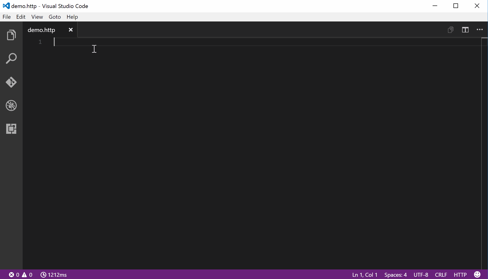

# REST Client

[](https://gitter.im/Huachao/vscode-restclient?utm_source=badge&utm_medium=badge&utm_campaign=pr-badge&utm_content=badge) [](https://marketplace.visualstudio.com/items?itemName=humao.rest-client) [](https://marketplace.visualstudio.com/items?itemName=humao.rest-client) [](https://marketplace.visualstudio.com/items?itemName=humao.rest-client) [](https://david-dm.org/Huachao/vscode-restclient)

REST Client allows you to send HTTP request and view the response in Visual Studio Code directly.

## Main Features
* Send __HTTP request__ in editor and view response in a separate pane with syntax highlight
* Send __CURL command__ in editor
* Auto save and view request history
* Global variables support (Only support system dynamic variables `{{$guid}}` and `{{$timestamp}}` now)
* Remember Cookies for subsequent requests
* Proxy support
* Code snippets for operations like `GET` and `POST`
* `HTTP` language support
    - `.http` and `.rest` file extensions support
    - Syntax highlight
    - Auto completion for method, header, global dynamic variables and mime types
    - Comments (line starts with `#` or `//`) support
    - Support `json` and `xml` body indentation, comment shortcut and auto closing brackets

## Usage
In editor, type a HTTP request as simple as below:
```http
https://example.com/comments/1
```
Or, you can follow the standard [RFC 2616](http://www.w3.org/Protocols/rfc2616/rfc2616-sec5.html) that including request method, headers and body.
```http
POST https://example.com/comments HTTP/1.1
content-type: application/json

{
    "name": "sample",
    "time": "Wed, 21 Oct 2015 18:27:50 GMT"
}
```
Once you prepared a request, use shortcut `Ctrl+Alt+R`, or press `F1` and then select/type `Rest Client: Send Request`, the response will be previewed in seperate panel of Visual Studio Code. When a request is issued,  will be disalyed in the status bar, when receiving the response, the icon will be changed to the duration.

## Install
Press `F1`, type `ext install rest-client`.

## Making Request

### Request Line
The first non-empty line of the selection (or document if nothing is selected) is the _Request Line_.
Below are some examples of _Request Line_:
```http
GET https://example.com/comments/1 HTTP/1.1
```
```http
GET https://example.com/comments/1
```
```http
https://example.com/comments/1
```
If request method is omitted, request will be treated as __GET__, so above requests are the same after parsing.

#### Query Strings
You can always write query strings in the request line, like:
```http
GET https://example.com/comments?page=2&pageSize=10
```
However you may want to spread query parameters into mutiple lines(one line one query parameter), we will parse the lines in request headers starts with `?` and `&`, like
```http
GET https://example.com/comments
    ?page=2
    &pageSize=10
```

### Request Headers
The lines immediately after the request line to first empty line are parsed as _Request Headers_. Please provide headers with the standard `field-name: field-value` format, each line represents one header.
Below are examples of _Request Headers_:
```http
user-agent: rest-client
accept-language: en-GB,en-US;q=0.8,en;q=0.6,zh-CN;q=0.4
```

### Request Body
If you want to provide the request body, please add a blank line after the request headers like the POST example in usage, and all content after it will be treated as _Request Body_.
Below are examples of _Request Body_:

```http
POST https://example.com/comments HTTP/1.1
content-type: application/xml
authorization: token xxx

<request>
    <name>sample</name>
    <time>Wed, 21 Oct 2015 18:27:50 GMT</time>
</request>
```

## Making CURL Request

We add the capability to directly run [curl request](https://curl.haxx.se/) in REST Client extension. The making request command is the same as previous one. REST Client will automatically parse the request with specified parser.

## Request History

Each time we sent a http request, the request details(method, url, headers and body) would be persisted into file. By using shortcut `Ctrl+Alt+H`, or press `F1` and then select/type `Rest Client: Request History`, you can view the last __50__ request items in the time reversing order, you can select any request you wish to trigger again. After specified request history item is selected, the request details would be displayed in a temp file, you can view the request details or follow previous step to trigger the request again.

## HTTP Language
Add language support for HTTP request, with __syntax highlight__, __autocomplete__ and __comment support__, when writing HTTP request in Visual Studio Code. By default, the language association will be automatically activated in two cases:

1. File with extension `.http` and `.rest`
2. First line of file follows standard request line in [RFC 2616](http://www.w3.org/Protocols/rfc2616/rfc2616-sec5.html), with `Method SP Request-URI SP HTTP-Version` format

If you want to enable language association in other cases, just change the language mode to `HTTP`.


Currently we will auto complete for four cases:

1. HTTP Method
2. HTTP Header
3. Global dynamic variables
4. MIME Types for `Accept` and `Content-Type` headers

## Variables
### Global Variables
Global variables provide a set of variables that can be used in every part of the request(Url/Headers/Body) in the format `{{variableName}}`. Currently, we provide a few dynamic variables which you can use in your requests.
* `{{$guid}}`: Add a RFC 4122 v4 UUID
* `{{$timestamp}}`: Add a number of milliseconds between 1970/1/1 UTC Time and now

```http
POST https://example.com/comments HTTP/1.1
Content-Type: application/xml
X-Request-Id: {{$guid}}

{
    "time": "{{$timestamp}}"
}
```

## Settings
* `rest-client.followredirect`: Follow HTTP 3xx responses as redirects. (Default is __true__)
* `rest-client.defaultuseragent`: If User-Agent header is omitted in request header, this value will be added as user agent for each request. (Default is __vscode-restclient__)
* `rest-client.timeoutinmilliseconds`: Timeout in milliseconds. 0 for infinity. (Default is __0__)
* `rest-client.showResponseInDifferentTab`: Show response in different tab. (Default is __false__)
* `rest-client.rememberCookiesForSubsequentRequests`: Save cookies from `Set-Cookie` header in response and use for subsequent requests. (Default is __true__)
* `rest-client.enableTelemetry`: Send out anonymous usage data. (Default is __true__)

Rest Client respects the proxy settings made for Visual Studio Code (`http.proxy` and `http.proxyStrictSSL`).

## License
[MIT License](LICENSE)

## Change Log
See CHANGELOG [here](CHANGELOG.md)

## TODO
* Environment Support
* Per-Environment Variables Support

## Feedback
Please provide feedback through the [GitHub Issue](https://github.com/Huachao/vscode-restclient/issues) system, or fork the repository and submit PR.
